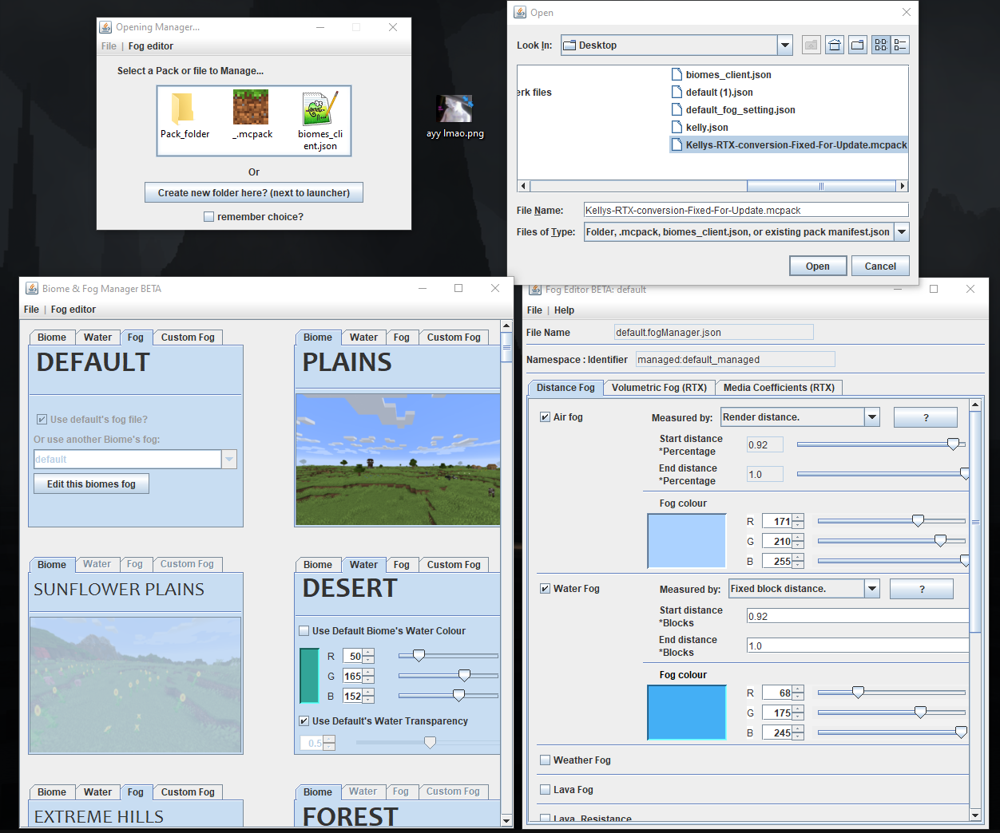

Downloads
======

(this program is still in the testing phase and may have bugs)

[Download v0.10 .EXE](https://github.com/btrab1/RTX_Fog_Biome_Pack_Manager/raw/main/out/artifacts/RTX_f_b_p_manager_jar/%5BRTX%5D%20Fog%20%26%20Biome%20%26%20Pack%20Manager%200.10.exe)

[Download v0.10 .JAR](https://github.com/btrab1/RTX_Fog_Biome_Pack_Manager/raw/main/out/artifacts/RTX_f_b_p_manager_jar/fog_setting_project.jar)

//v0.10 - bugfix when copying other biome not saving to file correctly

//v0.8 - quick bugfixes all the default files setup should work properly as do all the saving/exporting modes

[RTX]Fog & Biome & Pack Manager
------
This is the program i've been working on as an extension of my previous fog editor in the MC RTX discord server.

It is able to enable RTX, and manage the biomes and fog settings, of existing resource pack folders, .mcpack files, and standalone biome_client files. 
As well as create RTX ready packs for new creators.

#### Usages include: 
* creating game-ready fog-only packs as .mcpack's from scratch
* copying fog & biome settings from one pack to another pack (per biome)
* removing/adding/changing fog & biome settings in any pack 
* enable RTX in any pack as well as providing RTX fog to that pack
* customize all your pack's biome and fog settings with feedback, 

all from a simple to use GUI